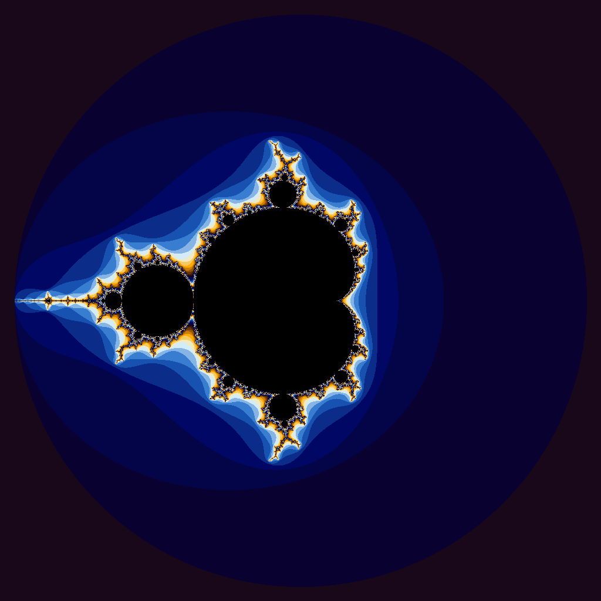
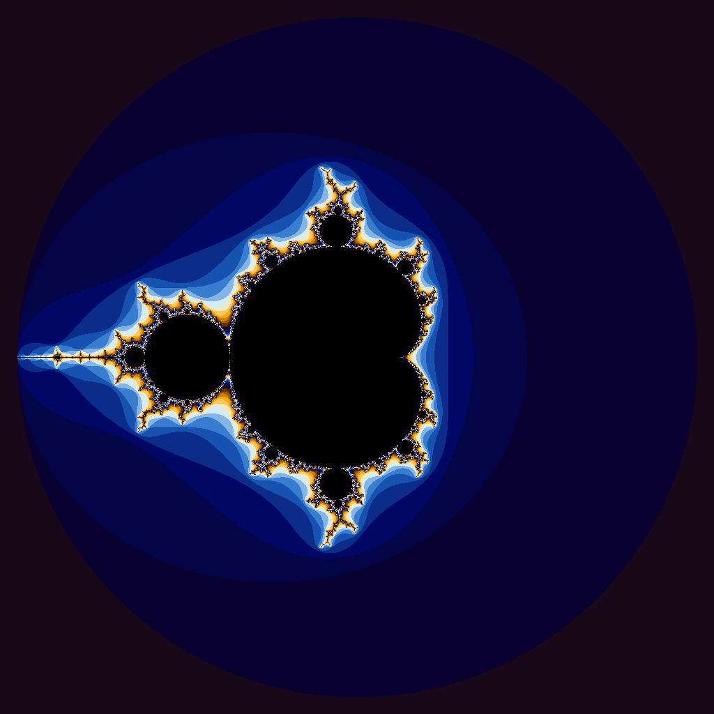

So I made the iota function, and I made some pretty pictures. Yay!

Question (for iota): Are the results what you expected? Speculate as to why it looks like CUDA isn’t a great solution for this problem.
Yeah, they're pretty much what I expected. Here are the results I got for GPU:

|Vector Length|Wall Clock Time|User Time|System Time|
|:--:|--:|--:|--:|
|10| 0.34| 0.01| 0.31|
|100| 0.25| 0.01| 0.23|
|1000| 0.26| 0.01| 0.23|
|10000| 0.26| 0.00| 0.24|
|100000| 0.26| 0.00| 0.23|
|1000000| 0.27| 0.01| 0.23|
|5000000| 0.29| 0.01| 0.25|
|100000000| 0.86| 0.15| 0.69|
|500000000| 3.39| 0.70| 2.66|
|1000000000| 7.00| 1.97| 5.01|
|5000000000|42.13|11.27|30.86|

And then here they are for CPU:
|Vector Length|Wall Clock Time|User Time|System Time|
|:--:|--:|--:|--:|
|10| 0.00| 0.00| 0.00|
|100| 0.00| 0.00| 0.00|
|1000| 0.00| 0.00| 0.00|
|10000| 0.00| 0.00| 0.00|
|100000| 0.00| 0.00| 0.00|
|1000000| 0.00| 0.00| 0.00|
|5000000| 0.02| 0.00| 0.02|
|100000000| 0.57| 0.09| 0.48|
|500000000| 2.93| 0.47| 2.45|
|1000000000| 5.75| 0.91| 4.83|
|5000000000|34.17| 6.07|28.10|

In other words, CPU outperformed GPU everywhere.
The operation itself is literally just values[i] = i + startValue. It isn't arithmetically intensive at ALL.
That means the amount of memory movement and setup overhead really shines.
The GPU happens to have a lot of that compared to the CPU, so it was slower everywhere, even on the larger sets.
In conclusion, iota does very little math per element so CUDA isn't a great solution for the problem by itself.

As for the mandelbrot set...
Here's your beautiful image.

And yes, the images are the same. But I linked both because I can. Sue me.